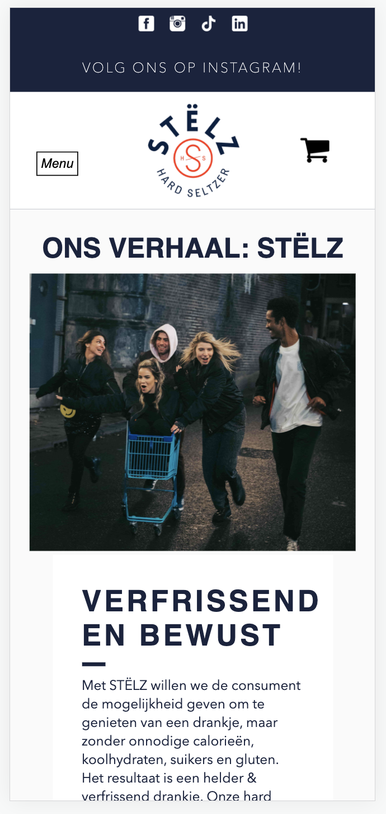
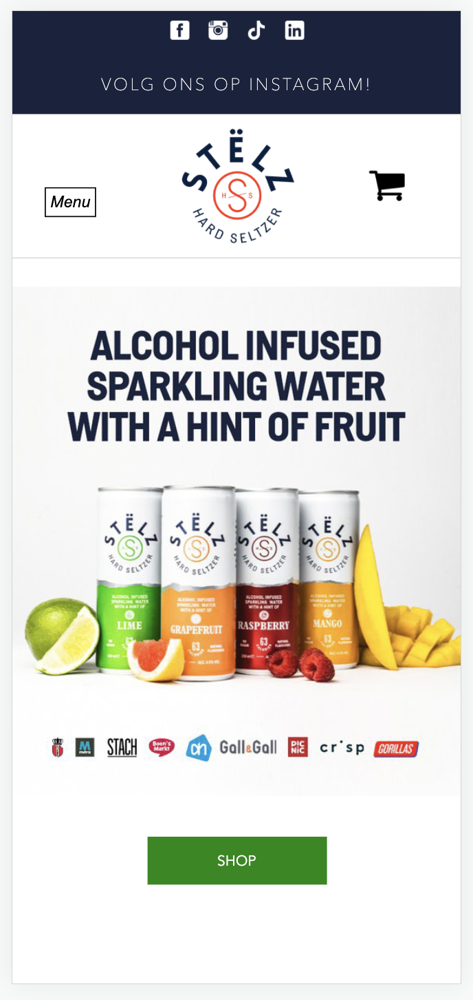

# Procesverslag
### Auteur:
Fleur Admiraal

#### Je startniveau:
Blauw

#### Je focus:
Surface plane
 

## Je website

uitwerken voor kick-off werkgroep

### Je opdracht:
https://drinkstelz.com/

#### Screenshot(s) van de eerste pagina (small screen): 
Home pagina

#### Screenshot(s) van de tweede pagina (small screen):
Over ons

 

## Breakdownschets (week 1)

### de hele pagina: 

### dynamisch deel (bijv menu): 

## Voortgang 1 (week 2)

uitwerken voor 1e voortgang

### Stand van zaken
Ik vond het moeilijk waar ik moest beginnen. Ik Begon te kijken naar de breakdownschetsen dit heeft mij erg geholpen. Hierna ben ik begonnen aan de HTML. Hierdoor wist ik waar ik moest beginnen. Ik kreeg een duidelijk beeld wat er precies in mijn HTML moest komen te staan wat ik erg fijn vond. 

### Feedback
- Ga zo door met de HTML
- Probeer volgende week alle HTML erin te hebben.
- Probeer alle links alsnog in te vullen met bijvoorbeeld een # of gwn de Index.html zodat er wel door screenreaders doorheen gegaan kan worden.
- Gebruik * als wildcart selector zodat je alles in een keer selectoren en zo de padding en margin standaard op 0 kan zetten. 

## Voortgang 2 (week 3)

uitwerken voor 2e voortgang

### Stand van zaken
Was lekker op weg. Met sommige dingen had ik veel moeite met bijvoorbeeld de header fixed te krijgen. Dit kwam omdat het bovenste gedeelte niet fixed moest zijn. Ook de font downloaden had ik veel moeite mee uiteindelijk is het me gelukt ik miste een ' waardoor hij het niet deed. 

### Feedback

- Doe de gehele header fixed. 
- Je hebt nu a'tjes in buttons dit is niet te bedoeling stijl de a als een button. 
- Je hebt ergens een li maar hier zit geen ul omheen pas dit aan. 

## Toegankelijkheidstest (week 4)

uitwerken na test in 8e voortgang

### Bevindingen Zicht
#### Central field loss
Het is te lezen. De 14px teksten zijn moeilijk te lezen. 

#### Blur/Glare Cataract 
De headings zijn makkelijk te lezen. De prijzen onder de Stëlz producten zijn niet te lezen. De broodteksten zijn ook moeilijk te lezen. 

#### Low Contrast
Het contrast is overal goed. Alle teksten zijn duidelijk en goed te lezen. De buttons zijn ook goed te zien en te lezen. 

####  Peripheral Field Loss
Het kost veel energie omdat je veel je hoofd moet bewegen. Wel alles is leesbaar. 

### Bevindingen Motoriek
Waarneer er bijvoorbeeld iets is met de motoriek bijvoorbeeld spamse is de website nog goed te bereiken doordat de knoppen niet te dicht bij elkaar staan wordt er niet snel mis geklikt. 

#### Titel nog een bevinding Gebroken hand/ Elastiekje om hand
De website is goed te bedienen. 

## Voortgang 3 (week 4)

uitwerken voor 3e voortgang

### Stand van zaken
Vond het nog steeds lastig en liep af en toe vast. Ik liep bijvoorbeeld vast met de slideshow. Hulp gevraagd en hierna lukte het me gemakkelijk om de slideshow erin te zetten. 

### Feedback 

- haal je website door de w3validator zodat je snel ziet of je nog ergens foutmeldingen heb. 
- Je hebt erg veel classes verander deze
- Gebruik meer opmerkingen

## Eindgesprek (week 5)

uitwerken voor eindgesprek

### Stand van zaken
Over het algemeen vond ik het erg moeilijk. Ik vind javascript erg lastig. De html en css ging gelukkig wel wat beter. Naar mate de weken vorderde kwam ik er wel steeds meer in en als het dan lukte vond ik het ook erg leuk. 

### Screenshot(s)

## Bronnenlijst

continu bijhouden terwijl je werkt

Nb. Wees specifiek ('css-tricks' als bron is bijv. niet specifiek genoeg).

1. https://dev.to/ljcdev/easy-hamburger-menu-with-js-2do0 - Hamburger menu 
2. https://www.w3schools.com/howto/howto_js_collapsible.asp - Collapsible 

